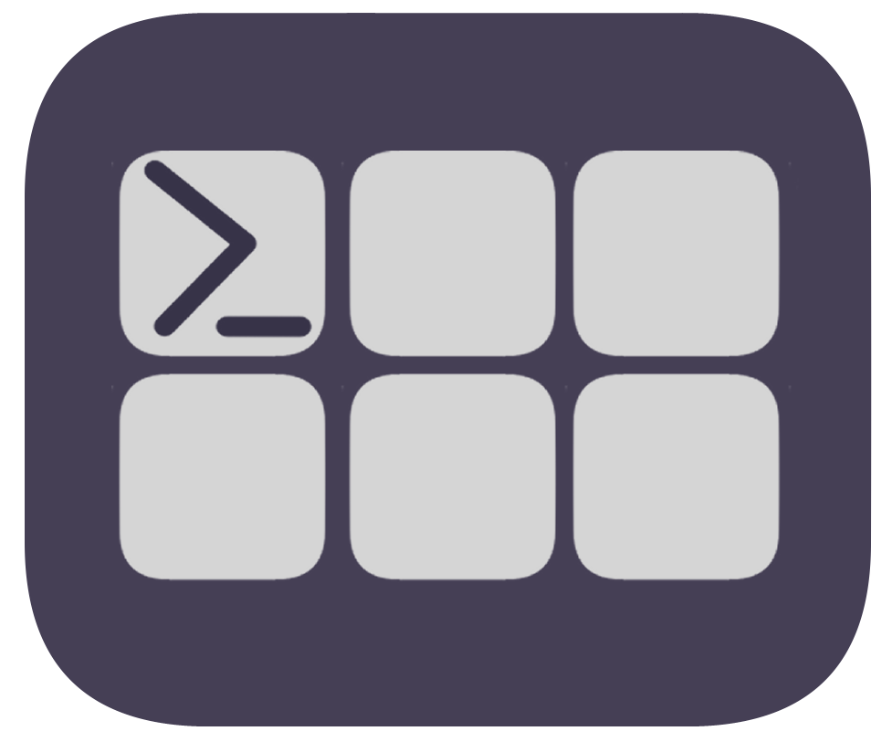

# DeckTerm

A terminal emulator built with Electron that supports remote control via a Stream Deck plugin through a WebSocket connection.



## Features

- 🚀 Fast and responsive terminal emulation
- 🎨 Dark theme
- 🔄 Remote control capabilities via WebSocket
- 💾 Persistent window state and configuration
- 🖥️ Cross-platform support (Windows, macOS, Linux)
- 🎮 Stream Deck integration for quick command execution
- 🔌 Customizable Stream Deck actions

## Architecture

DeckTerm is built using three main components:

1. **Terminal UI (@xterm/xterm)**
   - Provides the terminal interface
   - Handles text rendering and input capture
   - Supports terminal colors and formatting

2. **Shell Process (node-pty)**
   - Manages the actual terminal process
   - Supports any shell (PowerShell, cmd, Git Bash, bash, zsh, …)
   - Handles command execution

3. **Remote Control (WebSocket)**
   - Enables external control of the terminal
   - Allows sending commands remotely
   - Token-authenticated — see [WebSocket API](#websocket-api) below

# DeckTerm Application

## Installation

1. Install the DeckTerm application via one of the released installers.

## Configuration

DeckTerm stores its configuration in the Electron `userData` directory:

- **Windows:** `%APPDATA%\DeckTerm\config.json`
- **macOS:** `~/Library/Application Support/DeckTerm/config.json`
- **Linux:** `~/.config/DeckTerm/config.json`

Supported fields:

```json
{
  "customPath": "C:\\Program Files\\Git\\bin\\bash.exe",
  "fontSize": 14
}
```

| Field | Type | Description |
|---|---|---|
| `customPath` | string | Full path to the shell executable. Defaults to `cmd.exe` on Windows and `bash` on macOS/Linux. |
| `fontSize` | number | Terminal font size in px. Defaults to `14`. Can be changed at runtime with Ctrl+Scroll and is saved automatically. |

# Stream Deck Integration

DeckTerm comes with a built-in Stream Deck plugin that makes it easy to control your terminal right from your Stream Deck device.

## Installing the Stream Deck Plugin

1. Find the plugin package in the `StreamDeckPlugin/deck-term/` directory.
2. Double-click the `com.cedfro.deck-term.streamDeckPlugin` file to install.
3. Stream Deck software will automatically recognize and install the plugin.

## Creating Custom Actions

Two actions are available:

### Terminal Command
Sends any shell command to the active terminal session.

1. Drag the **Terminal Command** action onto a Stream Deck key.
2. Enter the command in the Property Inspector, e.g. `git status`, `npm start`, `docker ps`.
3. Press the key — the command is typed into your terminal as if you had typed it yourself.

### Open Terminal
Changes the working directory of the active terminal session.

1. Drag the **Open Terminal** action onto a Stream Deck key.
2. Enter the target directory path in the Property Inspector.
3. Press the key — DeckTerm runs `cd "<path>"` in the active shell.

## Example Use Cases

- One-click git operations
- Quick directory switching
- Project startup commands
- Server control (start/stop)
- Build commands
- Custom scripts

# WebSocket API

DeckTerm exposes a WebSocket server on port **3000**. The Stream Deck plugin uses it internally, but any local tool can integrate with it using the same protocol.

## Authentication

On startup, DeckTerm generates a token and writes it to:

- **Windows:** `%APPDATA%\DeckTerm\ws-token.json`
- **macOS:** `~/Library/Application Support/DeckTerm/ws-token.json`
- **Linux:** `~/.config/DeckTerm/ws-token.json`

The file contains:

```json
{ "token": "<uuid>" }
```

The token must be included in every message you send. Any message with a missing or incorrect token causes the connection to be immediately closed.

## Commands

Include the token in every message:

```json
// Execute a shell command
{ "type": "exec", "token": "<token>", "payload": { "command": "git status" } }

// Change directory
{ "type": "chdir", "token": "<token>", "payload": { "path": "/path/to/directory" } }
```

## Security boundary

The token protects against generic and opportunistic abuse: port scanners, random malware hitting port 3000, other tools accidentally connecting. It does **not** protect against a targeted process running as the **same OS user**, because that process can read the token file directly. This is an intentional, documented limit — any same-user process already has full shell access and does not need DeckTerm to cause harm.

If you need stronger isolation, consider running DeckTerm under a dedicated OS user account or switching the transport to a named pipe (contributions welcome).

## Development

### Electron App

```bash
cd DeckTerm
npm install
npm run dev     # development mode with HMR (electron-vite)
npm run build   # production build
npm run dist    # build distributable installers
```

### Stream Deck Plugin

```bash
cd StreamDeckPlugin/deck-term
npm install
npm run build   # single production build → com.cedfro.deck-term.sdPlugin/bin/plugin.js
npm run watch   # incremental build + auto-restart inside Stream Deck software
```

### Tech stack

| Component | Technology |
|---|---|
| Desktop framework | Electron 40 |
| Terminal renderer | @xterm/xterm + @xterm/addon-fit |
| Shell process | node-pty |
| WebSocket | ws |
| Build tool | electron-vite |
| Language | TypeScript (both app and plugin) |
| Stream Deck SDK | @elgato/streamdeck |

## License

This project is licensed under the ISC License — see the [LICENSE](LICENSE) file for details.